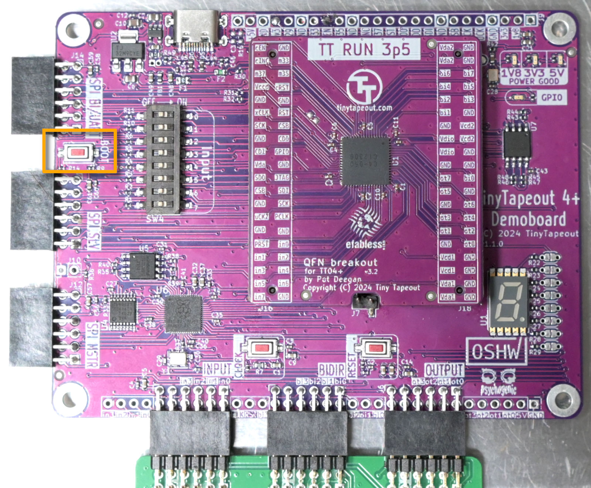

# TT4+ MicroPython SDK v2

&copy; 2024 Pat Deegan, [psychogenic.com](https://psychogenic.com)

This library provides the DemoBoard class, which is the primary
entry point to all the Tiny Tapeout demo pcb's RP2040 functionality.

What the RP2040 and this SDK provides, in addition to a base micropython environment (from crucial to nice-to-have):

  *  It provides an interface equivalent to the [Verilog project](https://github.com/TinyTapeout/tt10-verilog-template/blob/main/src/project.v) and compatible with [cocotb v2](https://www.cocotb.org/) DUTs
  
  *  Has a [cocotb v2](https://www.cocotb.org/) system to allow desktop @cocotb.test() functions to be used pretty much as-is, on the RP2040 with hardware in the loop, interacting with actual designs (for example, see the [factory test testbench](src/examples/tt_um_factory_test/tt_um_factory_test.py)
  
  *  Handles the demoboard pin multiplexing transparently (TT04 and TT05 demoboards)
  
  *  Allows you to forget the json config and do `tt.shuttle.tt_um_myproject.enable()` to select between projects on the chip

  *  Interfaces with all the project I/O, clocking and reset, lets you control those completely programatically, or clock+reset only (say, if you're connecting a PMOD like the Simon), or to be in full don't-touch mode while still being able to switch between projects

  *  Provides abstractions related to the ASIC, so you don't *have* to use individual pins but can think in terms of *ports* (inputs, outputs and bidirectionals)

  * Gives a system to allow for configuration using a simple config.ini: options for default project loaded on boot, clock speed (both RP2040 and project), settings for bidir pin directions on a per-project level, project load input pin state, etc 

  * Provides a REPL to muck about easily, with objects that are for the most part well behaved (dynamic attributes for each project in the shuttle, say, nice `__repr__` and `__str__` for things you'd want to look at etc)

    
# Installation

The RP2040 makes installation really simple:

  * get a UF2 file, which includes OS, SDK and configuration, from the [releases](https://github.com/TinyTapeout/tt-micropython-firmware/releases), e.g. 
  tt-demo-rp2040-v2.0.0

  * Hold the boot button on the demo board, and connect to computer via the USB port (top left)



  * Release the boot button, the RPI-RP2 drive should appear
  
  * Copy over the UF2 file
  
The system will go through a little sequence on first boot and twiddle the 7-segment display.  You may connect to the device during this time, using a serial terminal (appears as /dev/ttyACM0 on my system)


# Quick Start

See [main.py](src/main.py) to see how things are initialized by default and you can also see example interaction with projects from the SDK in the [examples packages](src/examples/).

A good way to get a feel for the system is to connect via a serial terminal through the USB port and explore the REPL.


## Selecting and loading projects

The DemoBoard object has a `shuttle` attribute, which is a container with all the project designs (loaded from a JSON file).

Projects are objects which are accessed by name, e.g.

```
>>> tt.shuttle.wokwi_shifty_snakey
<Design 74: wokwi_shifty_snakey>
```

or by project address

```
>>> tt.shuttle[74]
<Design 74: wokwi_shifty_snakey>
```


These can be enabled by calling ... enable()

```
>>> tt.shuttle.wokwi_shifty_snakey.enable()
ttboard.project_mux: Enable design wokwi_shifty_snakey
ttboard.demoboard: Resetting system clock to default 1.25e+08Hz
>>> 
```

This does all the control signal twiddling needed to select and enable the project using the snazzy TinyTapeout MUX.


If you know the specific project's official name, great, you can use that.  But if you don't, you can get a list of matching projects using `find()`, and call enable on any of the returned elements:

```
>>> tt.shuttle.find('traffic')
[<Design 71: wokwi_german_traffic_light>, <Design 180: wokwi_traffic_light>, <Design 115: wokwi_traffic_light_1>]
>>>
>>> tt.shuttle.find('traffic')[0].enable()
ttboard.project_mux: Enable design wokwi_german_traffic_light

```

Wokwi projects have horrible names like *tt_um_wokwi_375288605206694913* by default, which makes it pretty tough to peruse.  Instead, they get aliases based on their name in the shuttle, prefixed by wokwi:

```
>>> tt.shuttle.find('wokwi')
[ <Design 298: wokwi_2bit_alu_dice>, <Design 102: wokwi_7_segment_display>, <Design 192: wokwi_7_segment_seconds>, 
  <Design 32: wokwi_7_segment_seconds_verilog_demo>, <Design 99: wokwi_7segment_display_logic_system_>, 
  <Design 207: wokwi_agl_corticoneuro1>, <Design 101: wokwi_analog_clock>, <Design 41: wokwi_binary_counter>, 
  <Design 77: wokwi_blinking_a>, <Design 46: wokwi_character_selector>, <Design 40: wokwi_clock_divider>, 
# etc...
```

The currently enabled project, if any, is accessible in an `enabled` attribute on the shuttle

```
>>> tt.shuttle.tt_um_factory_test.enable()

>>> tt.shuttle.enabled
<Design 1: tt_um_factory_test>

>>> tt
<DemoBoard in ASIC_RP_CONTROL tt04 project 'tt_um_factory_test (1) @ https://github.com/TinyTapeout/tt04-factory-test'>

```


## Interacting with I/O

Through scripts installed on in the [micropython](https://www.micropython.org/) filesystem or with the demoboard plugged into USB and a serial terminal connected, you can load a design using the shuttle

```
>>> tt.shuttle
<ProjectMux for tt05 with 173 projects>
>>> tt.shuttle.tt_um_factory_test
<Design 1: tt_um_factory_test>
>>> tt.shuttle.tt_um_factory_test.enable()
ttboard.project_mux: Enable design tt_um_factory_test
ttboard.demoboard: Resetting system clock to default 1.25e+08Hz
ttboard.demoboard: Clocking at 10Hz
>>> 
```

With a project loaded, you can interact with the project I/O using the following attributes on the tt (DemoBoard) object

  * ui_in, design inputs
  
  * uo_out, design outputs
  
  * uio_in, design bidirectionals (as inputs)
  
  * uio_out, design bidirectionals (as outputs)
  
Note that these are all named from the **ASICs** point of view, i.e. you--from the RP2040 user side--will be *writing* to the inputs (ui_in) and reading from the outputs (uo_out).

```
>>> tt.ui_in
<IO ui_in 0x1>
>>> tt.ui_in.value
<LogicArray('00000001', Range(7, 'downto', 0))>
>>> tt.ui_in.value = 0
>>> tt.ui_in.value = 0b11110000
>>> tt.ui_in
<IO ui_in 0xf0>
>>> tt.ui_in.value
<LogicArray('11110000', Range(7, 'downto', 0))>
>>> int(tt.ui_in.value)
240
>>> hex(tt.ui_in.value)
'0xf0'

```


The second thing to keep in mind is that these ports are arranged in an order common when using Verilog.  That means that, for an 8-bit value like our ports, index 7 is the MSB and index 0 the LSB


```
>>> print(tt.ui_in.value)
11110000
>>> tt.ui_in[7]
<Logic ('1')>
>>> tt.ui_in[7] == 1
True
>>> tt.ui_in[0]
<Logic ('0')>
>>> tt.ui_in.value[0] = 1
>>> tt.ui_in.value[0] == 1
True

```

Though this is not yet supported in cocotb v2, read and writes to bits and slices are supported, both on the port (e.g. ui_in) and its value (ui_in.value)

```
>>> tt.ui_in.value = 0
>>> tt.ui_in.value
<LogicArray('00000000', Range(7, 'downto', 0))>
>>> tt.ui_in.value[5:2]
<LogicArray('0000', Range(5, 'downto', 2))>
>>> tt.ui_in.value[5:2] = 0b1010
>>> tt.ui_in.value
<LogicArray('00101000', Range(7, 'downto', 0))>
>>> tt.ui_in.value[5:2] == 0b1010
True
```


## Project clocking and reset

To put a project in or out of reset, use `project_reset(BOOL)`

```
# hold in reset
>>> tt.reset_project(True)
ttboard.demoboard: Changing reset to output mode
# ... do things
>>> tt.reset_project(False)
# now not in reset

```

When in reset, the `rst_n` pin is held LOW.  The button on the demoboards does the same job.

Clocking can be done manually using the button (assuming you *aren't* auto-clocking), a single tick at a time or the system may be auto-clocked.

```
# do one clock cycle:
>>> tt.clock_project_once()

# auto-clock using PWM
>>> tt.clock_project_PWM(1000)
ttboard.demoboard: Clocking at 1000Hz
>>> tt.is_auto_clocking
True
>>> tt.auto_clocking_freq
1000
>>> tt.clock_project_stop()
>>> tt.is_auto_clocking
False
```


## REPL and Scripting

After install, scripts or the REPL may be used.  With micropython, the contents of main.py are executed on boot.

Efforts have been made to make console use easy, so most things have a terse representation you can see by just typing in the object

```
>>> tt.shuttle
<ProjectMux for tt05 with 173 projects>
>>> tt.shuttle.enabled
<Design 1: tt_um_factory_test>
>>> tt.uo_out
<IO uo_out 0x0>
```

and many objects also have string representations that provide more and/or prettier information

```
>>> print(tt.shuttle)
Shuttle tt05
>>> print(tt.uo_out)
00000000
>>> print(tt.shuttle.enabled)
tt_um_factory_test (1) @ https://github.com/TinyTapeout/tt05-factory-test
>>> print(tt.user_config.tt_um_vga_clock)
tt_um_vga_clock
  clock_frequency: 3.15e+07
  mode: ASIC_RP_CONTROL
  rp_clock_frequency: 1.26e+08
```

Here's a sample REPL interaction with an overview of things to do

```
from machine import Pin
from ttboard.mode import RPMode
from ttboard.demoboard import DemoBoard

# get a handle to the board
tt = DemoBoard()

# enable a specific project, e.g.
tt.shuttle.tt_um_factory_test.enable()

print(f'Project {tt.shuttle.enabled.name} running')

# play with the inputs
tt.ui_in[0] = 1
tt.ui_in[7] = 1
# or as a byte
tt.ui_in.value = 0xAA

# start automatic project clocking
tt.clock_project_PWM(2e6) # clocking projects @ 2MHz


# observe some outputs
if tt.uo_out[2]:
   print("Aha!")

print(f'Output is now {tt.uo_out}')

# play with bidir pins manually (careful)
tt.uio_oe_pico.value = 0b100
tt.uio_in[2] = 1 # set high

# if you changed modes on pins, like bidir, and want 
# to switch project, reset them to IN or just
tt.mode = RPMode.ASIC_RP_CONTROL # or RPMode.SAFE etc
```


# Usage

The quick start above gives you a good idea of how this all works.

If using this code as-is, with the main.py included, a `tt` object will already be instantiated.  Type

```
tt.
```

and then use the TAB-completion--it's really handy and let's you know what's available.  E.g.

```
tt.shuttle.<TAB><TAB>
```

will show you all the projects you can enable.


## Initialization

When the DemoBoard object is created, you _may_ give it a parameter to indicate how you intend to use it.  

If not specifed, the value in `config.ini` DEFAULT section `mode` will be used.


Possible values are:

```
# use ini value
tt = DemoBoard() # whatever was in DEFAULT.mode of config.ini


# safe mode, the default
tt = DemoBoard(RPMode.SAFE) # all RP2040 pins are inputs

# or: ASIC on board
tt = DemoBoard(RPMode.ASIC_RP_CONTROL) # ASIC drives the inputs (i.e. in0, in1 etc are OUTPUTS for the RP2040)

# or: ASIC on board but you want to twiddle inputs and clock 
# using on-board DIP switches and buttons
tt = DemoBoard(RPMode.ASIC_MANUAL_INPUTS) # ASIC drives only management pins all else are inputs


```

If you've played with the pin mode (direction), you've loaded a project that modified the mode or you just want to change modes, you can set the attribute explicitly or call reset() on the Pins container

```

# simply set the tt mode
tt.mode = RPMode.ASIC_RP_CONTROL

# or call reset on the pins, to set to whatever the
# last mode was
tt.pins.reset()

# or with a parameter, to change modes
tt.pins.reset(RPMode.SAFE) # make everything* an input
```


### Automatic Load and Default Config

The `config.ini` file has a **DEFAULT** section that may be used to specify the demo board mode, and default project to enable.

```
[DEFAULT]
# project: project to load by default
project = tt_um_test

# start in reset (bool)
start_in_reset = no

# mode can be any of
#  - SAFE: all RP2040 pins inputs
#  - ASIC_RP_CONTROL: TT inputs,nrst and clock driven, outputs monitored
#  - ASIC_MANUAL_INPUTS: basically same as safe, but intent is clear
mode = ASIC_RP_CONTROL

```
Each project on the shuttle may have it's own section as well, with additional attributes.  All attributes are optional.
See the config section, below, for details.


## Projects

## Configuration

A `config.ini` file may be used to setup defaults (e.g. default mode or project to load on boot) as well as specific configuration to apply when loading a project in particular.  See the included `config.ini` for samples with commentary.

Projects may use their own sections in this file to do preliminary setup, like configure clocking, direction and state of bidir pins, etc.

If you're connected to the REPL, the configuration can be probed just by looking at the repr string or printing the object out


```
>>> tt.user_config
<UserConfig config.ini, default project: tt_um_factory_test>
>>> 
>>> print(tt.user_config)
UserConfig config.ini, Defaults:
project: tt_um_factory_test
mode: ASIC_RP_CONTROL
```


If any override sections are present in the file, sections will show you which are there, and these are present as 
attributes you can just looking at to see summary info, or print out to see everything the section actually does. 

```
>>> tt.user_config.sections
['tt_um_factory_test', 'tt_um_urish_simon', 'tt_um_psychogenic_neptuneproportional', 'tt_um_test', 'tt_um_loopback', 'tt_um_vga_clock', 'tt_um_algofoogle_solo_squash']
>>> 
>>> tt.user_config.tt_um_urish_simon
<UserProjectConfig tt_um_urish_simon, 50000Hz, mode: ASIC_MANUAL_INPUTS>
>>>
>>> tt.user_config.tt_um_psychogenic_neptuneproportional
<UserProjectConfig tt_um_psychogenic_neptuneproportional, 4000Hz, mode: ASIC_RP_CONTROL>
>>>
>>> print(tt.user_config.tt_um_vga_clock)
UserProjectConfig tt_um_vga_clock
{'rp_clock_frequency': 1.26e+08, 'mode': 'ASIC_RP_CONTROL', 'clock_frequency': 3.15e+07}
```


### Sections and Values

This is *similar* to, but not the same (because hand-crufted) as the python config parser.

Sections are simply name `[SECTION]`.

Values are 

```
key = value
```

Where the value may be

   * a string
   * a numerical value (an int, float, 0xnn or 0bnnnnnnnn representation)
   * a boolean (true, false, yes, no)
   * a comment (a line beginning with #)


### System Defaults

System-wide default settings supported are

project: (string) name of project to load on boot, e.g. *tt_um_loopback*

mode: (string) ASIC_RP_CONTROL, ASIC_MANUAL_INPUTS (to use the on-board switches/buttons), or SAFE 

start_in_reset: (bool) whether projects should have their nRESET pin held low when enabled

rp_clock_frequency: system clock frequency


### Project-specific

Some values may be auto-configured when enabling a project, by having them specified in their own section.
The section name is 

```
[PROJECT_NAME]
```

as specified in the shuttle, for instance

```
[tt_um_psychogenic_neptuneproportional]

```

Values that may be set are
 * clock_frequency: Frequency, in Hz, to auto-clock on project clock pin (ignored if in ASIC_MANUAL_INPUTS)
 * rp_clock_frequency: system clock frequency -- useful if you need precision for your project clock PWM
 * input_byte: value to set for inputs on startup (ignored if in ASIC_MANUAL_INPUTS)
 * bidir_direction: bits set to 1 are driven by RP2040
 * bidir_byte: actual value to set (only applies to outputs)
 * mode: tt mode to set for this project


Values unspecified in a configuration are left as-is on project enable().

Project auto-clocking is stopped by default when a project is loaded.  If the clock_frequency is set, then 
it will be setup accordingly (*after* the rp_clock_frequency has been configured if that's present).

Bi-directional pins (uio*) are reset to inputs when enabling another project.


## Pins

Pins may be read by "calling" them:

```
if tt.uo_out[5]:
    # do something
```

and set by calling with a param

```
tt.ui_in[7] = 1
```

Mode may be set with the `mode` attrib

```
tt.ui03.mode = Pin.OUT
```


Pins that are outputs (depends on tt mode) may be setup to automatically clock using

```
tt.pins.uio_in3.pwm(FREQUENCY, [DUTY_16])
```

If FREQUENCY is 0, PWM will stop and it will revert to simple output.  If duty cycle is not specified, it will be 50% (0xffff/2).


The tt ran out of pinnage for all the things it wanted to do, so some of the connections actually go through a multiplexer.

Do you care?  No.  And you shouldn't need to.

All the pins can be read or set by simply calling them:

```
tt.uio_out[4] # no param: read.  Returns the current value of uio4
tt.ui_in[7] = 0 # with a param: write.  So here, make in7 low
```


The callable() interface for the pins is available regardless of which pin it is.

Under the hood, these aren't actually *machine.Pin* objects (though you can access that too) but in most instances they behave the same, so you could do things like `tt.pins.ui_in7.irq(...)` etc.  In addition, they have some useful properties that I have no idea why are lacking from machine.Pin most of the time, e.g.

```
tt.pins.uio_in4.mode = Pin.IN
tt.pins.uio_in4.pull = Pin.PULL_UP

print(f'{tt.pins.uio_in4.name} is on GPIO {tt.pins.uio_in4.gpio_num} and is an {tt.pins.uio_in4.mode_str}')
```


In some instances--those pins that are actually behind the hardware multiplexer--*all* they 
have is the call() interface and will die if you try to do machine.Pin type things.

This is on purpose, as a reminder that these are special (e.g. `out0` isn't really a pin, here... 
you want an IRQ? set it explicitly on `tt.sdi_out0`).  See below, in "MUX Stuff" for more info.

Pins that are logically grouped together in our system can be accessed that way:

```

for i in tt.inputs:
    i(1)

# easier to just
tt.ui_in.value = 0xff

print(tt.uo_out.value)
tt.bidirs[2](1)

```

The list (all 8 pins) and XYZ_byte attributes are available for inputs, outputs and bidir.  Finally, these ports also have a XYZ_mode attribute, which is just a list of the pin direction that lets you read them or set them all in one go, mostly useful with the bidir pins.

```
>>> from machine import Pin
>>> # uio pins are currently all inputs
>>> tt.pins.uio_in2.mode == Pin.OUT
False
>>> tt.pins.uio_in3.mode == Pin.OUT
False
>>> # change all to outputs, say
>>> tt.uio_oe[:] = [Pin.OUT]*8
>>> tt.pins.uio_in2.mode == Pin.OUT
True
```


If you do not care for all this OO mucking about, you can always do things manual style as well.  The 
RP GPIO to name mapping is available in the schematic or just use GPIOMap class attribs:

```
import machine
from ttboard.pins import GPIOMap

p = machine.Pin(GPIOMap.IN6, machine.Pin.OUT)
# and all that
```

Just note that the MUX stuff needs to be handled for those pins.  


### Available pins
The pins available on the tt object include

  * out0 - out7 # outputs, available as output_byte as well
  * in0 - in7 # inputs, available as input_byte
  * uio0 - uio7 # bidirectional pins, available as bidir_byte
  * project_clk # the clock for synch projects
  * project_nrst # the reset pin


Though you can play with these two last to your heart's content, the easiest way to interact with these functions is through the utility methods:

  * clock_project_PWM(FREQHz) / clock_project_stop()
  * clock_project_once()
  * tt.reset_project(BOOL) (True puts project in reset)
  


NOTE that this naming reflect the perspective of the *ASIC*.  The *ASIC* normally be writing to out pins and reading from in pins, and this is how pins are setup when using the `ASIC_RP_CONTROL` mode (you, on the RP2040, read from out5 so it is an Pin.IN, etc).


### MUX Stuff

In all instance except where the GPIO pins are MUXed, these behave just like machine.Pin objects.

For the MUXed pins, these are also available, namely

  * sdi_nprojectrst
  * cena_out1
  * ncrst_out2
  * cinc_out3
  
You don't normally want to play with these, but you can.  The interesting thing you 
don't *have* to know is how the MUX is transparently handled, but I'm telling you 
anyway with an example

```
>>> # look at this muxed bare GPIO pin
>>> tt.sdi_nprojectrst
<MuxedPin sdi_nprojectrst 3 (HPIN selected, OUT) sdi[OUT]/nprojectrst[OUT]>

>>> # act on the transparently muxed pin object
>>> tt.sdi(1)

>>> # now the demoboard mux has switched over
>>> tt.sdi_nprojectrst
<MuxedPin sdi_nprojectrst 3 (LPIN selected, OUT) sdi[OUT]/nprojectrst[OUT]>

>>> # use the reset, which is shared with SDI
>>> tt.rst_n(1)

>>> # demoboard mux is back to high-side selected
>>> tt.sdi_nprojectrst
<MuxedPin sdi_nprojectrst 3 (HPIN selected, OUT) sdi[OUT]/nprojectrst[OUT]>
>>> 


```

## Useful Utils

You may do everything manually, if desired, using the pins.  Some useful utility methods are

```

# reset_project: make it clear
tt.reset_project(True) # held in reset
tt.reset_project(False) # not in reset


# under normal operation, the project clock is 
# an output 
>>> tt.clk
<StandardPin rp_projclk 0 OUT>


# clock_project_PWM: enough bit-banging already
# auto PWM the project_clk
tt.clock_project_PWM(500e3) # clock at 500kHz

Since it's PWMed, we now have direct access to that
>>> tt.clk
<PWM slice=0 channel=0 invert=0>

>>> tt.project_clk.freq()
500000


# later
tt.clock_project_stop() # ok, stop that
# or
tt.clock_project_PWM(0) # stops it

# back to normal output
>>> tt.clk
<StandardPin rp_projclk 0 OUT>

```

You may also PWM any other pin, in the usual uPython way, but you'll have to manage it on your own and deinit if you switch projects etc.  

When using project PWM auto-clocking, or any PWM, be sure to set the RP system clock, if required, before engaging the PWM--I've seen bad behaviour otherwise.

Many objects have decent representation so you can inspect them just by entering their references in the console

```
>>> tt
<DemoBoard as ASIC_RP_CONTROL, auto-clocking @ 10, project 'tt_um_test' (in RESET)>

>>> tt.pins.uio_in3
<StandardPin uio3 24 IN>

>>> tt.pins.ui_in0
<StandardPin in0 9 OUT>

```

And the DemoBoard objects have a *dump()* method to help with debug.

```
>>> tt.dump()

Demoboard status
Demoboard default mode is ASIC_RP_CONTROL
Project nRESET pin is OUT 0
Project clock PWM enabled and running at 10
Selected design: tt_um_test
Pins configured in mode ASIC_RP_CONTROL
Currently:
  cena_uo_out1 IN 0
  cinc_uo_out3 IN 0
  hk_csb OUT 1
  hk_sck IN 0
  hk_sdo IN 0
  ncrst_uo_out2 IN 0
  rp_projclk IN 0
  rpio29 IN 0
  sdi_nprojectrst IN 1
  ui_in0 OUT 1
  ui_in1 OUT 0
  ui_in2 OUT 0
  ui_in3 OUT 0
  ui_in4 OUT 0
  ui_in5 OUT 0
  ui_in6 OUT 0
  ui_in7 OUT 0
  uio0 IN 0
  uio1 IN 0
  uio2 IN 0
  uio3 IN 0
  uio4 IN 0
  uio5 IN 0
  uio6 IN 0
  uio7 IN 0
  uo_out0 IN 0
  uo_out4 IN 0
  uo_out5 IN 0
  uo_out6 IN 0
  uo_out7 IN 0


```


