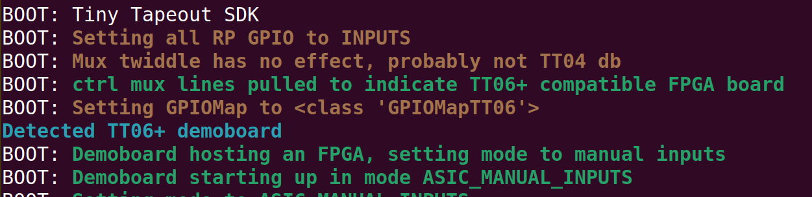
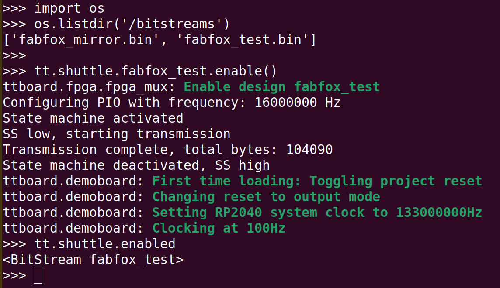

# TT4+ MicroPython SDK v2

&copy; 2024 Pat Deegan, [psychogenic.com](https://psychogenic.com)

This library provides the DemoBoard class, which is the primary
entry point to all the Tiny Tapeout demo pcb's RP2040 functionality.

What the RP2040 and this SDK provides, in addition to a base micropython environment (from crucial to nice-to-have):

  *  It provides an interface equivalent to the [Verilog project](https://github.com/TinyTapeout/tt10-verilog-template/blob/main/src/project.v) and compatible with [cocotb v2](https://www.cocotb.org/) DUTs
  
  *  Has a [cocotb v2](https://www.cocotb.org/) system to allow desktop @cocotb.test() functions to be used pretty much as-is, on the RP2040 with hardware in the loop, interacting with actual designs (for example, see the [factory test testbench](src/examples/tt_um_factory_test/tt_um_factory_test.py)
  
  *  Handles the demoboard pin multiplexing transparently (TT04 and TT05 demoboards)
  
  *  Allows you to forget the json config and do `tt.shuttle.tt_um_myproject.enable()` to select between projects on the chip

  *  Interfaces with all the project I/O, clocking and reset, lets you control those completely programatically, or clock+reset only (say, if you're connecting a PMOD like the Simon), or to be in full don't-touch mode while still being able to switch between projects

  *  Provides abstractions related to the ASIC, so you don't *have* to use individual pins but can think in terms of *ports* (inputs, outputs and bidirectionals)

  * Gives a system to allow for configuration using a simple config.ini: options for default project loaded on boot, clock speed (both RP2040 and project), settings for bidir pin directions on a per-project level, project load input pin state, etc 

  * Provides a REPL to muck about easily, with objects that are for the most part well behaved (dynamic attributes for each project in the shuttle, say, nice `__repr__` and `__str__` for things you'd want to look at etc)

    
# Installation

The RP2040 makes installation really simple:

  * get a UF2 file, which includes OS, SDK and configuration, from the [releases](https://github.com/TinyTapeout/tt-micropython-firmware/releases), e.g. 
  tt-demo-rp2040-v2.0.0

  * Hold the boot button on the demo board, and connect to computer via the USB port (top left)


  * Release the boot button, the RPI-RP2 drive should appear
  
  * Copy over the UF2 file
  
The system will go through a little sequence on first boot and twiddle the 7-segment display.  You may connect to the device during this time, using a serial terminal (appears as /dev/ttyACM0 on my system)


# Quick Start

See [main.py](src/main.py) to see how things are initialized by default and you can also see example interaction with projects from the SDK in the [examples packages](src/examples/).

A good way to get a feel for the system is to connect via a serial terminal through the USB port and explore the REPL.


## Selecting and loading projects

The DemoBoard object has a `shuttle` attribute, which is a container with all the project designs (loaded from a JSON file).

Projects are objects which are accessed by name, e.g.

```
>>> tt.shuttle.wokwi_shifty_snakey
<Design 74: wokwi_shifty_snakey>
```

or by project address

```
>>> tt.shuttle[74]
<Design 74: wokwi_shifty_snakey>
```


These can be enabled by calling ... enable()

```
>>> tt.shuttle.wokwi_shifty_snakey.enable()
ttboard.project_mux: Enable design wokwi_shifty_snakey
ttboard.demoboard: Resetting system clock to default 1.25e+08Hz
>>> 
```

This does all the control signal twiddling needed to select and enable the project using the snazzy TinyTapeout MUX.


If you know the specific project's official name, great, you can use that.  But if you don't, you can get a list of matching projects using `find()`, and call enable on any of the returned elements:

```
>>> tt.shuttle.find('traffic')
[<Design 71: wokwi_german_traffic_light>, 
 <Design 180: wokwi_traffic_light>, 
 <Design 115: wokwi_traffic_light_1>]
>>>
>>> tt.shuttle.find('traffic')[0].enable()
ttboard.project_mux: Enable design wokwi_german_traffic_light

```

Wokwi projects have horrible names like *tt_um_wokwi_375288605206694913* by default, which makes it pretty tough to peruse.  Instead, they get aliases based on their name in the shuttle, prefixed by wokwi:

```
>>> tt.shuttle.find('wokwi')
[ <Design 298: wokwi_2bit_alu_dice>, <Design 102: wokwi_7_segment_display>, 
  <Design 192: wokwi_7_segment_seconds>, <Design 32: wokwi_7_segment_seconds_verilog_demo>, 
  <Design 99: wokwi_7segment_display_logic_system_>, <Design 207: wokwi_agl_corticoneuro1>, 
  <Design 101: wokwi_analog_clock>, <Design 41: wokwi_binary_counter>, 
# etc...
```

The currently enabled project, if any, is accessible in an `enabled` attribute on the shuttle

```
>>> tt.shuttle.tt_um_factory_test.enable()

>>> tt.shuttle.enabled
<Design 1: tt_um_factory_test>

>>> tt
<DemoBoard in ASIC_RP_CONTROL tt04 project 'tt_um_factory_test (1) @ https://github.com/TinyTapeout/tt04-factory-test'>

```


## Interacting with I/O

Through scripts installed on in the [micropython](https://www.micropython.org/) filesystem or with the demoboard plugged into USB and a serial terminal connected, you can load a design using the shuttle

```
>>> tt.shuttle
<ProjectMux for tt05 with 173 projects>
>>> tt.shuttle.tt_um_factory_test
<Design 1: tt_um_factory_test>
>>> tt.shuttle.tt_um_factory_test.enable()
ttboard.project_mux: Enable design tt_um_factory_test
ttboard.demoboard: Resetting system clock to default 1.25e+08Hz
ttboard.demoboard: Clocking at 10Hz
>>> 
```

With a project loaded, you can interact with the project I/O using the following attributes on the tt (DemoBoard) object

  * ui_in, design inputs
  
  * uo_out, design outputs
  
  * uio_in, design bidirectionals (as inputs)
  
  * uio_out, design bidirectionals (as outputs)
  
Note that these are all named from the **ASICs** point of view, i.e. you--from the RP2040 user side--will be *writing* to the inputs (ui_in) and reading from the outputs (uo_out).

```
>>> tt.ui_in
<IO ui_in 0x1>
>>> tt.ui_in.value
<LogicArray('00000001', Range(7, 'downto', 0))>
>>> tt.ui_in.value = 0
>>> tt.ui_in.value = 0b11110000
>>> tt.ui_in
<IO ui_in 0xf0>
>>> tt.ui_in.value
<LogicArray('11110000', Range(7, 'downto', 0))>
>>> int(tt.ui_in.value)
240
>>> hex(tt.ui_in.value)
'0xf0'

```


The second thing to keep in mind is that these ports are arranged in an order common when using Verilog.  That means that, for an 8-bit value like our ports, index 7 is the MSB and index 0 the LSB


```
>>> print(tt.ui_in.value)
11110000
>>> tt.ui_in[7]
<Logic ('1')>
>>> tt.ui_in[7] == 1
True
>>> tt.ui_in[0]
<Logic ('0')>
>>> tt.ui_in.value[0] = 1
>>> tt.ui_in.value[0] == 1
True

```

Though this is not yet supported in cocotb v2, read and writes to bits and slices are supported, both on the port (e.g. ui_in) and its value (ui_in.value).

Note that a slice acts like in verilog, such that `value[2:0]` is **3** bits wide.

```
>>> tt.ui_in.value = 0
>>> tt.ui_in.value
<LogicArray('00000000', Range(7, 'downto', 0))>
>>> tt.ui_in.value[5:2]
<LogicArray('0000', Range(5, 'downto', 2))>
>>> tt.ui_in.value[5:2] = 0b1010
>>> tt.ui_in.value
<LogicArray('00101000', Range(7, 'downto', 0))>
>>> tt.ui_in.value[5:2] == 0b1010
True
```


## Project clocking and reset

To put a project in or out of reset, use `project_reset(BOOL)`

```
# hold in reset
>>> tt.reset_project(True)
ttboard.demoboard: Changing reset to output mode
# ... do things
>>> tt.reset_project(False)
# now not in reset

```

When in reset, the `rst_n` pin is held LOW.  The button on the demoboards does the same job.

Clocking can be done manually using the button (assuming you *aren't* auto-clocking), a single tick at a time or the system may be auto-clocked.

```
# do one clock cycle:
>>> tt.clock_project_once()

# auto-clock using PWM
>>> tt.clock_project_PWM(1000)
ttboard.demoboard: Clocking at 1000Hz
>>> tt.is_auto_clocking
True
>>> tt.auto_clocking_freq
1000
>>> tt.clock_project_stop()
>>> tt.is_auto_clocking
False
```


## REPL and Scripting

After install, scripts or the REPL may be used.  With micropython, the contents of main.py are executed on boot.

Efforts have been made to make console use easy, so most things have a terse representation you can see by just typing in the object

```
>>> tt.shuttle
<ProjectMux for tt05 with 173 projects>
>>> tt.shuttle.enabled
<Design 1: tt_um_factory_test>
>>> tt.uo_out
<IO uo_out 0x0>
```

and many objects also have string representations that provide more and/or prettier information

```
>>> print(tt.shuttle)
Shuttle tt05
>>> print(tt.uo_out)
00000000
>>> print(tt.shuttle.enabled)
tt_um_factory_test (1) @ https://github.com/TinyTapeout/tt05-factory-test
>>> print(tt.user_config.tt_um_vga_clock)
tt_um_vga_clock
  clock_frequency: 3.15e+07
  mode: ASIC_RP_CONTROL
  rp_clock_frequency: 1.26e+08
```

Here's a sample REPL interaction with an overview of things to do

```
from machine import Pin
from ttboard.mode import RPMode
from ttboard.demoboard import DemoBoard

# get a handle to the board
tt = DemoBoard()

# enable a specific project, e.g.
tt.shuttle.tt_um_factory_test.enable()

print(f'Project {tt.shuttle.enabled.name} running')

# play with the inputs
tt.ui_in[0] = 1
tt.ui_in[7] = 1
# or as a byte
tt.ui_in.value = 0xAA

# start automatic project clocking
tt.clock_project_PWM(2e6) # clocking projects @ 2MHz


# observe some outputs
if tt.uo_out[2]:
   print("Aha!")

print(f'Output is now {tt.uo_out}')

# play with bidir pins manually (careful)
tt.uio_oe_pico.value = 0b100
tt.uio_in[2] = 1 # set high

# if you changed modes on pins, like bidir, and want 
# to switch project, reset them to IN or just
tt.mode = RPMode.ASIC_RP_CONTROL # or RPMode.SAFE etc
```


# Usage

The quick start above gives you a good idea of how this all works.

If using this code as-is, with the main.py included, a `tt` object will already be instantiated.  Type

```
tt.
```

and then use the TAB-completion--it's really handy and let's you know what's available.  E.g.

```
tt.u<TAB><TAB>
```

will show you all the i/o ports you can play with.


## Initialization

When the DemoBoard object is created, you _may_ give it a parameter to indicate how you intend to use it.  

If not specifed, the value in [config.ini](src/config.ini) DEFAULT section `mode` will be used.


Possible values are:

```
# use ini value
tt = DemoBoard() # whatever was in DEFAULT.mode of config.ini


# safe mode, the default
tt = DemoBoard(RPMode.SAFE) # all RP2040 pins are inputs

# or: ASIC on board
# ASIC drives the inputs (i.e. ui_in pins are OUTPUTS 
# for the RP2040)
tt = DemoBoard(RPMode.ASIC_RP_CONTROL) 


# or: ASIC on board but you want to twiddle inputs and clock 
# using on-board DIP switches and buttons
# ASIC drives only management pins all else are inputs
tt = DemoBoard(RPMode.ASIC_MANUAL_INPUTS) 


```

If you've played with the pin mode (direction), you've loaded a project that modified the mode or you just want to change modes, you can set the attribute

```

# simply set the tt mode
tt.mode = RPMode.ASIC_RP_CONTROL
```

### Automatic Load and Default Config

The [config.ini](src/config.ini) file has a **DEFAULT** section that may be used to specify the demo board mode, default project to enable and other things.

Each project on the shuttle may have it's own section as well, with additional attributes.  All attributes are optional.

More info on this file and its parameters may be found in [config.md](config.md)

When using the SDK, the user config and various sections are exposed through the `tt.user_config` attribute.

```
>>> tt.user_config
<UserConfig config.ini, default project: tt_um_factory_test>
>>> 
>>> print(tt.user_config)
UserConfig config.ini, Defaults:
project: tt_um_factory_test
mode: ASIC_RP_CONTROL
```


If any override sections are present in the file, sections will show you which are there, and these are present as 
attributes you can just looking at to see summary info, or print out to see everything the section actually does. 

```
>>> tt.user_config.sections
['tt_um_factory_test', 'tt_um_urish_simon', 
  'tt_um_psychogenic_neptuneproportional', 'tt_um_test', 'tt_um_loopback', 
  'tt_um_vga_clock', 'tt_um_algofoogle_solo_squash']
>>> 
>>> tt.user_config.tt_um_urish_simon
<UserProjectConfig tt_um_urish_simon, 50000Hz, mode: ASIC_MANUAL_INPUTS>
>>>
>>> tt.user_config.tt_um_psychogenic_neptuneproportional
<UserProjectConfig tt_um_psychogenic_neptuneproportional, 4000Hz, mode: ASIC_RP_CONTROL>
>>>
>>> print(tt.user_config.tt_um_vga_clock)
UserProjectConfig tt_um_vga_clock
{'rp_clock_frequency': 1.26e+08, 
 'mode': 'ASIC_RP_CONTROL', 
 'clock_frequency': 3.15e+07}
```


## uPython Pins

Individual pins may be read, either on the port in question

```
if tt.uo_out[5]:
    # do something
```

or on the cocotb-like .value

```
if tt.uio_out.value[3]:
    # do something else
```

and set by assigment:

```
tt.ui_in[7] = 1
```

This also works with slices:

```
tt.ui_in[4:2] = 0b101
```

Again, it's worth noting that this acts as in verilog, so ui_in[4:2] includes bits 4,3 and 2.


### Fast I/O

All the I/O port abstractions and the cocotb compatibility aare nice, but sometimes there's a need for speed.

To read or write a byte in a single, low-level, call, use the fast micropython native functions from the platform, e.g.

```
>>> import ttboard.util.platform as platform
>>> platform.read_ui_in_byte()
1
>>> platform.write_ui_in_byte(4)
>>> platform.read_ui_in_byte()
4
```

The naming is read/write_u*_byte, so the available functions are

  * read_ui_in_byte()
  
  * read_uio_byte()
  
  * read_uo_out_byte()
  
  * read_uio_outputenable()
  
  * write_ui_in_byte(VAL)
  
  * write_uio_byte(VAL)
  
  * write_uo_out_byte(VAL)
  
  * write_uio_outputenable(VAL)


### RP2040 pin objects

It's recommended that you stick with reading and writing values using the u* ports or the low-level platform calls, as described above.

Still, there may be cases where you want to play with micropython pin objects themselves, say to set pull-ups

In those particular cases, the tt.pins object has 

  * ui_inN
  
  * uo_outN
  
  * uioN
  
attributes you can interact with.

```
>>> tt.pins.uo_out5.pull == Pin.PULL_UP
False
>>> tt.pins.uo_out5.pull = Pin.PULL_UP
>>> tt.pins.uo_out5.pull == Pin.PULL_UP
True
```


Pins that are outputs (depends on tt mode) may be setup to automatically clock using

```
tt.pins.uio_in3.pwm(FREQUENCY, [DUTY_16])
```

If FREQUENCY is 0, PWM will stop and it will revert to simple output.  If duty cycle is not specified, it will be 50% (0xffff/2).


## FPGA Breakout

There is now a TT06+ demoboard compatible [FPGA ASIC Simulator](https://github.com/TinyTapeout/breakout-pcb/tree/main/ASIC-simulator/tt06-fpga-ICE40UP5k).  


The latest SDK should automatically detect this board and allow it to be loaded up with bitstreams directly through the tt object.




To use it, place suitably created bitstreams on the RP2040 filesystem, within a `/bitstreams` directory.  From there, on boot, the system will detect any files suffixed by `.bin` and allow you to load them in a manner analogous to the ASIC projects, using the `tt.shuttle` object.




## Release History and Compatibility Matrix


|TT Edition | Timeline   | Compatible Release   | Incompatible Release | Factory Release |
|-----------|------------|----------------------|----------------------|-----------------|
|06         | 2024 Q4    | minimum 1.2.0+       | before 1.2.0         | v2.0.0RC5       |
|05         | 2024 Q2    | 0 to latest          |                      | v1.2.0          |
|04         | 2024 Q2    | 0 to latest          |                      | v1.1.0          |
|03p5       | 2024 Q1    | 0 to 1.2.x           | since 2.0.0          | v0.9.16d        |


