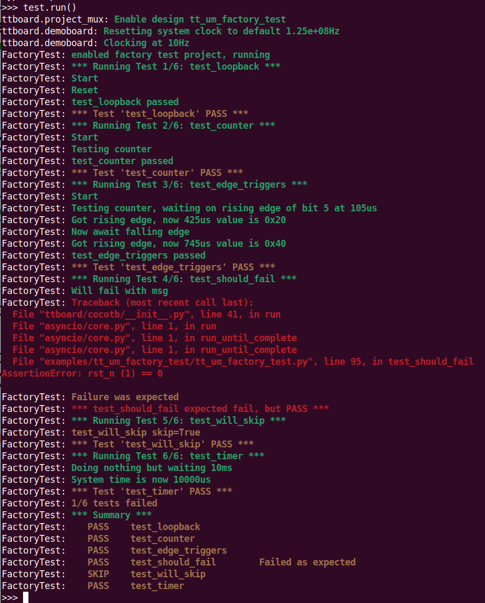

# SDK project interaction examples and tests

This is the home of sample interaction scripts and tests specific to given projects.

The idea is to have a standardized place for sample code and to allow people to try out projects with ease.

As of version 2.0 of the SDK, the demoboard API has been standardized to match that used in Verilog (uo_out, ui_in, etc) and made such that existing [cocotb version 2.0](https://www.cocotb.org/) tests should be usable, in many cases as-is.

 

## Quick start


A system is in place to support [cocotb](https://www.cocotb.org/) style tests, such that the code used during development simulation should be usable (almost) as-is with hardware-in-the-loop, directly on the demoboard.

For example

```
@cocotb.test()
async def test_counter(dut):
    dut._log.info("Start")
    clock = Clock(dut.clk, 10, units="us")
    cocotb.start_soon(clock.start())
    dut.uio_oe_pico.value = 0 # all inputs on our side
    
    dut.ui_in.value = 0b1
    dut.rst_n.value = 0
    await ClockCycles(dut.clk, 10)
    dut.rst_n.value = 1
    await ClockCycles(dut.clk, 1)

    dut._log.info("Testing counter")
    for i in range(256):
        assert dut.uo_out.value == dut.uio_out.value, f"uo_out != uio_out"
        assert int(dut.uo_out.value) == i, f"uio value not incremented correctly {dut.uio_out.value} != {i}"
        await ClockCycles(dut.clk, 1)
        
    
    dut._log.info("test_counter passed")
```

will be detected as a test case and run as part of the testbench.  You can see the full sample in [tt_um_factory_test.py](tt_um_factory_test/tt_um_factory_test.py).

To run an existing test, import the module and call its `run()` function:

```
>>> import examples.tt_um_factory_test as test
>>> test.run()
```



# Adding samples

If you have a project on a chip and would like to run your own tests, you can re-use much of your cocotb testbench (you did have a testbench, right?).

To start

  * create a package using the name of your project as per the submitted info.yaml.  This is a subdirectory of that name with an `__init__.py` file.
  
  * create modules that include your `@cocotb.test()` functions
  
  * import those modules and expose a `run()` method in your top level `__init__.py`.


### cocotb.test() 

The `cocotb.test()` functions should work as-is, with the following caveats

  * We don't have access to internals, so restrict the tests to treating the *dut* as a blackbox, meaning you can only play with I/O (writing to `dut.ui_in` and `dut.uio_in`, reading from `dut.uo_out` and `dut.uio_out`)
  
  * The bidirectional pin direction is actually set by the design inside the chip.  We are outside the ASIC, so you  must **mirror** that (i.e. if the project sets a pin as an input, we want to set the corresponding pin as an output to be able to write to it within tests)

To make the fact that you are setting bidir pin direction from the RP2040 side, the API uses the name `uio_oe_pico`.

If, for example, the project verilog sets

```
    assign uio_oe  = 0xf0 /* 0b11110000 high nibble out, low nibble in*/
```
Then, in your test, you would set

```
	dut.uio_oe_pico = 0x0f # 0b00001111 high nibble in, low nibble out
```


### functionality 

Within tests, you may read

  * dut.uo_out.value
  
  * dut.uio_out.value
	
and write to 

  * dut.ui_in.value 
  
  * dut.uio_in.value

and do the usual things, like

```
    assert dut.uo_out.value == 4, f"output should be 4!"
    # or
    dut.ui_in.value = 0xff
    await ClockCycles(dut.clk, 2)
```

In addition, though this is as of yet unsupported in cocotb v2 (I've submitted patches and there's an ongoing discussion), value bit and slice access is fully supported, for example

```
	dut.ui_in.value[0] = 1
	dut.ui_in.value[3:2] = 0b11 
	assert dut.uo_out.value[7] == 1, "high bit should be TRUE"
```

The SDK cocotb implementation supports

  * @cocotb.test() detection, with all optional parameters (though as of now only name, and skip are respected)
    
  * setting up one or more clocks using Clock() and cocotb.start_soon()
    
  * await on Timer, ClockCycles, RisingEdge, and FallingEdge


### test runner

This is the area with the greatest delta from standard cocotb functionality.

We need a function to:

  * load and enable the design
    
  * create a suitable DUT instance
  
  * get the test runner and run all the detected cocotb.test()s.


```
from ttboard.demoboard import DemoBoard
from ttboard.cocotb.dut import DUT
def main():
    tt = DemoBoard.get()
    
    # make certain this chip has the project
    if not tt.shuttle.has('tt_um_factory_test'):
        print("This shuttle doesn't have mah project??!!")
        return
    
    # enable the project
    tt.shuttle.tt_um_factory_test.enable()
    
    dut = DUT()
    dut._log.info("enabled project, running, running tests")
    runner = cocotb.get_runner()
    runner.test(dut)
    
```


### DUT extensions

If your tests are *only* using the ui_in/uo_out/uio_in/uio_out ports, then the runner above using the default DUT class will just work.

There are cases where tests are safe, in that they do not access any internals of the design, but you've added convenience functionality or renaming to the verilog tb, and your cocotb tests reflect that.

For example, my old neptune testbench looks like this in verilog


```


// testbench is controlled by test.py
module tb (
    input [2:0] clk_config,
    input input_pulse,
    input display_single_enable,
    input display_single_select,
    output [6:0] segments,
    output prox_select
    );

    // this part dumps the trace to a vcd file that can be viewed with GTKWave
    initial begin
        $dumpfile ("tb.vcd");
        $dumpvars (0, tb);
        #1;
    end

    // wire up the inputs and outputs
    reg  clk;
    reg  rst_n;
    reg  ena;
    // reg  [7:0] ui_in;
    reg  [7:0] uio_in;
    wire [7:0] uo_out;
    wire [7:0] uio_out;
    wire [7:0] uio_oe;
    
    assign prox_select = uo_out[7];
    assign segments = uo_out[6:0];
    
    wire [7:0] ui_in = {display_single_select, 
                        display_single_enable, 
                        input_pulse, 
                        clk_config[2], clk_config[1], clk_config[0],
                        1'b0,1'b0};

   /* ... */
```

and my cocotb tests use the nicely named `input_pulse` (a bit), `clk_config` (3 bits), etc.

The first option would be to re-write all the cocotb.test() stuff to use only ui_in and such.  Yuk.

Rather than do all that work, and have ugly `tt.ui_in.value[5]` stuff everywhere as a bonus, you can extend the DUT class to add in wrappers to these values.

To do this, you just derive a new class from `ttboard.cocotb.dut.DUT`, create the attributes using `new_bit_attribute` or `new_slice_attribute` (for things like `tt.ui_in[3:1]`).

In my neptune case, this looks like:

```
import ttboard.cocotb.dut

class DUT(ttboard.cocotb.dut.DUT):
    def __init__(self):
        super().__init__('Neptune')
        self.tt = DemoBoard.get()
        # inputs
        self.display_single_select = self.new_bit_attribute(self.tt.ui_in, 7)
        self.display_single_enable = self.new_bit_attribute(self.tt.ui_in, 6)
        self.input_pulse = self.new_bit_attribute(self.tt.ui_in, 5)
        self.clk_config = self.new_slice_attribute(self.tt.ui_in, 4, 2) # tt.ui_in[4:2]
        # outputs
        self.prox_select = self.new_bit_attribute(self.tt.uo_out, 7)
        self.segments = self.new_slice_attribute(self.tt.uo_out, 6, 0) # tt.uo_out[6:0]
````

Using that class to construct my dut, things like

```

    pulseClock = Clock(dut.input_pulse, 1000*(1.0/tunerInputFreqHz), units='ms')
    cocotb.start_soon(pulseClock.start())
    # or
    val = int(dut.segments.value) << 1
```

will justwork(tm) in the tests.
    

